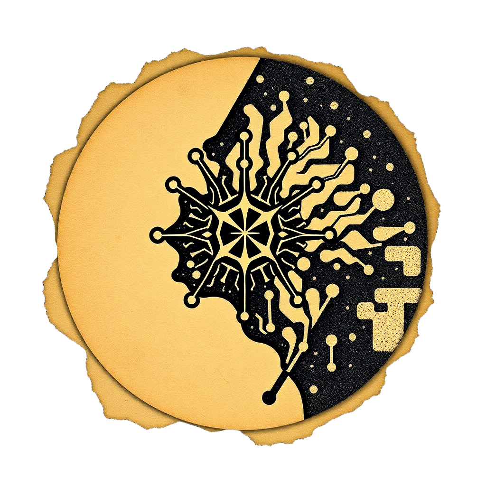

   
   

## Covenant AI

Covenant AI is a smart lease contract analysis system that leverages Agentic RAG for information retrieval.
The RAG architecture is built without the use of external libraries/frameworks for scalability. 

> For a comprehensive overview, please visit [the offical Covenant AI Documentation](https://sehat-inc.github.io/covenant-ai/) 

## 📜 Get Started

### Installing Tesseract
Below are platform-specific instructions:

### Windows
1. Download and install from:
   https://github.com/UB-Mannheim/tesseract/wiki
2. Ensure the tesseract.exe location is added to your PATH.

### macOS
1. Install Homebrew if needed (https://brew.sh).
2. Run: `brew install tesseract`.

### Linux (Ubuntu/Debian)
1. Update your package list: `sudo apt-get update`.
2. Install Tesseract: `sudo apt-get install tesseract-ocr`.

After installation, verify with:  
`tesseract --version`

## 🌱 Contributing to Covenant AI

### Naming Conventions
- **Lower Case/Pascal Case** for folder names. `numberofdonuts`/`NumberOfDonuts`
- **Camel Case** for file names. `numberOfDonuts`
- **Snake Case** for variable names. `number_of_donuts`
- **Pascal Case/Lower Case** for function names. `NumberOfDonuts`/`numberofdonuts`